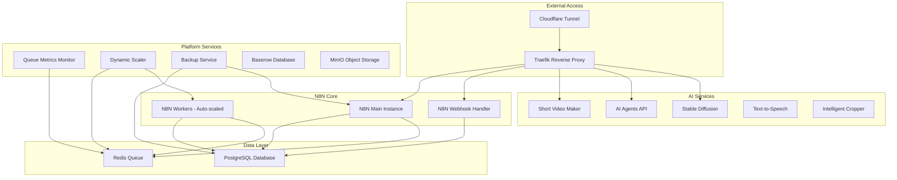

# N8N AI Services Platform

A comprehensive Docker Compose stack for running N8N workflow automation with integrated AI services, auto-scaling, and monitoring capabilities.

> **Latest Update:** Now includes Cloudflare tunnel support, refactored auto-scaling, and comprehensive AI service integration.

## 🏗️ System Architecture

This platform combines N8N workflow automation with a suite of AI services, providing a complete automation and AI processing solution:

- **N8N Workflow Engine** - Main automation platform with queue-based processing
- **Dynamic Auto-Scaling** - Intelligent worker scaling based on queue metrics  
- **AI Services** - Video generation, text-to-speech, image processing, and more
- **Real-time Monitoring** - Queue metrics and system observability
- **Reverse Proxy** - Traefik with SSL termination and routing
- **Data Persistence** - PostgreSQL database and Redis queue management

### Architecture Diagram



## ✨ Features

- **🔄 Dynamic Auto-Scaling** - Intelligent worker scaling based on queue depth
- **🤖 Integrated AI Services** - Video generation, image processing, TTS, and more
- **📊 Real-time Monitoring** - Queue metrics with structured logging
- **🔒 Security First** - Cloudflare tunnels, non-root containers, encrypted data
- **🚀 Production Ready** - Health checks, backups, and graceful shutdowns
- **📦 Easy Deployment** - Single Docker Compose command
- **🎯 GPU Support** - ROCm optimization for AMD graphics cards
- **🔧 Highly Configurable** - Environment-based configuration

## 🚀 Quick Start Guide

### Prerequisites

- **Docker & Docker Compose v2+** - Container orchestration
- **System Requirements:**
  - 16GB RAM minimum (32GB+ recommended for AI services)
  - 100GB+ free disk space
  - Linux host (tested on Ubuntu/Fedora)
- **Optional:** AMD RX 6000+ series or NVIDIA GPU for AI acceleration
- **Cloudflare Account** - For secure tunneling (recommended)

### Step 1: Repository Setup

```bash
# Clone the repository
git clone <your-repo-url>
cd ai-automata

# Initialize submodules for AI services
git submodule update --init --recursive

# Create Docker network (for external integrations)
docker network create shark
```

### Step 2: Environment Configuration

```bash
# Copy the example environment file
cp .env.example .env

# Edit configuration (IMPORTANT: Set your own passwords!)
nano .env
```

**🔑 Critical Environment Variables to Configure:**

```bash
# Cloudflare Tunnel (get from cloudflare.com)
CLOUDFLARE_TUNNEL_TOKEN=your-tunnel-token-here

# Security (GENERATE NEW VALUES!)
N8N_ENCRYPTION_KEY=your-32-character-encryption-key
POSTGRES_PASSWORD=your-secure-database-password

# Domains (configure your subdomains)
N8N_HOST=n8n.yourdomain.com
N8N_WEBHOOK=webhook.yourdomain.com
TRAEFIK_HOST=traefik.yourdomain.com

# AI Service APIs (optional but recommended)
PEXELS_API_KEY=your-pexels-api-key
OPENAI_API_KEY=your-openai-api-key
```

### Step 3: Start the Platform

**Option A: Core Services Only (Recommended for First Run)**
```bash
docker compose --profile core up -d
```

**Option B: Core + GPU AI Services**
```bash
docker compose --profile core --profile anim up -d
```

**Option C: All Services (Resource Intensive)**
```bash
docker compose --profile core --profile anim --profile disabled up -d
```

### Step 4: Verify Deployment

```bash
# Check service status
docker compose ps

# Monitor startup logs
docker compose logs -f n8n-main n8n-queue-metrics n8n-dynamic-scaler

# Check health status
docker compose ps --format "table {{.Name}}\t{{.Status}}\t{{.Health}}"
```

### Step 5: Access Your Platform

- **🔧 N8N Workflow Editor:** `https://n8n.yourdomain.com`
- **📊 Traefik Dashboard:** `https://traefik.yourdomain.com`
- **🤖 AI Agents API:** `https://ai-agent.yourdomain.com/docs`
- **🎥 Video Maker:** `https://video-maker.yourdomain.com`
- **🎨 Stable Diffusion:** `https://stable-diffusion.yourdomain.com`

## ⚙️ Service Profiles Explained

The platform uses Docker Compose profiles to manage different service groups efficiently:

### 🚀 Core Profile (`--profile core`)
**Essential services for N8N operation:**
- N8N main instance, workers, and webhook handler
- PostgreSQL database and Redis queue
- Queue metrics monitoring and dynamic auto-scaling
- Traefik reverse proxy and Cloudflare tunnel
- Automated backup service
- Basic AI services (CPU-based video maker, AI agents)
- MinIO object storage and Baserow database

**Resource Usage:** ~8GB RAM, 4 CPU cores

### 🎨 Animation Profile (`--profile anim`)
**GPU-accelerated AI services for advanced content generation:**
- Stable Diffusion WebUI (image generation)
- Stable Video Diffusion via ComfyUI
- WAN2.1 Video Generation
- CogVideo (experimental video AI)
- ROCm-optimized for AMD GPUs

**Resource Usage:** +16GB RAM, GPU required

### 🧪 Disabled Profile (`--profile disabled`)
**Experimental and alternative services:**
- ROCm-enabled alternatives to CPU services
- Development/testing versions
- Experimental AI models

**Resource Usage:** Variable

## 🔧 Configuration Deep Dive

### N8N Core Configuration

```bash
# Queue-based execution (required for auto-scaling)
EXECUTIONS_MODE=queue
QUEUE_BULL_REDIS_HOST=redis
QUEUE_HEALTH_CHECK_ACTIVE=true

# Performance tuning
N8N_CONCURRENCY_PRODUCTION_LIMIT=10          # Tasks per worker
N8N_QUEUE_BULL_GRACEFULSHUTDOWNTIMEOUT=300   # Graceful shutdown time
N8N_GRACEFUL_SHUTDOWN_TIMEOUT=300            # Total shutdown timeout

# Webhook configuration
N8N_WEBHOOK_URL=https://webhook.yourdomain.com
WEBHOOK_URL=https://webhook.yourdomain.com

# Security
N8N_SECURE_COOKIE=true
N8N_ENFORCE_SETTINGS_FILE_PERMISSIONS=true
```

### Auto-Scaling Configuration

The dynamic scaler intelligently manages N8N workers based on real-time queue metrics:

```bash
# Scaling boundaries
MIN_REPLICAS=1                    # Always keep at least 1 worker
MAX_REPLICAS=5                    # Maximum concurrent workers
 
# Scaling triggers
SCALE_UP_QUEUE_THRESHOLD=5        # Scale up when queue > 5 jobs
SCALE_DOWN_QUEUE_THRESHOLD=0      # Scale down when queue empty

# Timing controls
POLLING_INTERVAL_SECONDS=30       # Check queue every 30 seconds
COOLDOWN_PERIOD_SECONDS=120       # Wait 2 minutes between scaling actions

# Queue configuration
QUEUE_NAME_PREFIX=bull            # BullMQ prefix
QUEUE_NAME=jobs                   # Queue name
```

**🧠 Scaling Logic:**
1. Monitor Redis queue depth every 30 seconds
2. **Scale Up:** When queue length > threshold AND current replicas < max
3. **Scale Down:** When queue length ≤ threshold AND current replicas > min  
4. **Cooldown:** Prevent rapid scaling with configurable wait periods
5. **Gradual:** Scale one worker at a time for stability

### AI Services Configuration

**🎥 Short Video Maker:**
```bash
PEXELS_API_KEY=your-key           # For stock footage
VIDEO_CACHE_SIZE_IN_BYTES=1GB     # Local cache size
WHISPER_MODEL=medium.en           # Speech recognition model
```

**🤖 AI Agents:**
```bash
OPENAI_API_KEY=your-key           # For GPT integration
LOG_LEVEL=debug                   # Logging verbosity
```

**🎨 Stable Diffusion:**
```bash
# ROCm GPU optimization (AMD)
HSA_OVERRIDE_GFX_VERSION=10.3.0   # GPU compatibility
PYTORCH_HIP_ALLOC_CONF=expandable_segments:True
WEBUI_PORT=7860                   # Web interface port
```

## 📊 Monitoring and Observability

### Queue Metrics Monitor
Real-time Redis queue monitoring with structured logging:

```bash
# View queue metrics
docker compose logs -f n8n-queue-metrics

# Example output:
# 2024-01-01T12:00:00 [INFO] Queue metrics queue=bull:jobs waiting_jobs=3
# 2024-01-01T12:00:00 [INFO] Detailed queue stats wait=3 active=2 completed=45 failed=0
```

**Features:**
- ✅ Multi-pattern BullMQ support (v3+, v4+, legacy)
- ✅ Automatic Redis reconnection with exponential backoff
- ✅ Structured JSON logging with timestamps
- ✅ Health checks and error recovery

### Dynamic Scaler
Intelligent auto-scaling with decision logging:

```bash
# Monitor scaling decisions
docker compose logs -f n8n-dynamic-scaler

# Example output:
# 2024-01-01T12:00:00 [INFO] Current metrics queue_length=7 current_replicas=2
# 2024-01-01T12:00:00 [INFO] Scaling decision made target_replicas=3 reason="Queue length 7 > threshold 5"
# 2024-01-01T12:00:00 [INFO] Scaling completed successfully new_replicas=3
```

**Features:**
- ✅ Predictive scaling based on queue trends  
- ✅ Docker Compose integration for seamless scaling
- ✅ Configuration validation and setup checks
- ✅ Graceful error handling and recovery

### Health Monitoring

```bash
# Check all service health
docker compose ps --format "table {{.Name}}\t{{.Status}}\t{{.Health}}"

# View service resource usage
docker stats --format "table {{.Container}}\t{{.CPUPerc}}\t{{.MemUsage}}"

# Monitor specific service logs
docker compose logs --tail=100 -f service-name
```

## 💾 Data Management and Backups

### Automated Backup System

**Daily Backups Include:**
- PostgreSQL database dumps
- N8N workflows and credentials  
- Binary data and configurations
- Retention: 7 days automatic cleanup

```bash
# Manual backup
docker compose exec n8n-backup sh -c "
  BACKUP_DATE=\$(date +%Y%m%d-%H%M%S)
  pg_dump -h postgres -U postgres -d n8n_db > /backups/manual-\$BACKUP_DATE.sql
  tar -czf /backups/manual-backup-\$BACKUP_DATE.tar.gz -C /source .
"

# View available backups
ls -la ./daily-backups/

# Restore from backup
docker compose down
docker compose run --rm postgres psql -h postgres -U postgres -d n8n_db < backup.sql
tar -xzf backup.tar.gz -C ./backups/
docker compose --profile core up -d
```

### Data Persistence

**Volume Mappings:**
```
./backups/n8n-data          → N8N application data
./backups/n8n-workflows     → Workflow definitions
./backups/n8n-credentials   → Encrypted credentials
./backups/n8n-binary        → Binary data storage
./postgres-data/pgdata      → Database files
./videos                    → Generated video content
./data/minio                → Object storage
```

**🔗 Symbolic Links for Data Continuity:**
The system uses symbolic links to maintain data continuity when moving between directories, ensuring your workflows and data remain intact during deployments.

## 🛠️ Advanced Usage

### Custom N8N Nodes

```bash
# Add custom nodes
mkdir -p ./services/custom-nodes
# Place your node packages here - they'll be auto-mounted
```

### Adding New AI Services

1. **Define in docker-compose.yml:**
```yaml
my-ai-service:
  image: my-ai-service:latest  
  container_name: n8n-my-ai-service
  restart: unless-stopped
  profiles:
    - core
  networks:
    - n8n-network
  environment:
    - API_KEY=${MY_AI_API_KEY}
  labels:
    - "traefik.enable=true"
    - "traefik.http.routers.my-ai.rule=Host(`${MY_AI_HOST}`)"
    - "traefik.http.routers.my-ai.entrypoints=web"
```

2. **Add to .env:**
```bash
MY_AI_HOST=my-ai.yourdomain.com
MY_AI_API_KEY=your-api-key
```

3. **Update .env.example** with placeholders

### Performance Optimization

**High-Volume Workflows:**
```bash
# Increase worker capacity
MAX_REPLICAS=10
N8N_CONCURRENCY_PRODUCTION_LIMIT=20

# Database optimization
POSTGRES_SHARED_BUFFERS=256MB
POSTGRES_MAX_CONNECTIONS=200

# Redis optimization  
REDIS_MAXMEMORY=2gb
REDIS_MAXMEMORY_POLICY=allkeys-lru
```

**GPU Acceleration:**
```bash
# Ensure proper GPU drivers
# AMD: ROCm 5.4+ 
# NVIDIA: Container toolkit

# Verify GPU access
docker run --rm --device=/dev/kfd --device=/dev/dri rocm/pytorch:latest rocminfo
```

## 🔍 Troubleshooting Guide

### Common Issues and Solutions

**❌ Services won't start:**
```bash
# Check configuration syntax
docker compose config

# Validate environment variables
docker compose config | grep -A5 -B5 ERROR

# Check resource availability
docker system df
free -h
```

**❌ N8N can't connect to database:**
```bash
# Verify PostgreSQL health
docker compose exec postgres pg_isready -U postgres

# Check credentials consistency
grep -E "POSTGRES_(USER|PASSWORD|DB)" .env

# View database logs
docker compose logs postgres
```

**❌ Auto-scaling not working:**
```bash
# Check queue metrics service
docker compose logs n8n-queue-metrics

# Verify scaler decisions
docker compose logs n8n-dynamic-scaler  

# Test Docker socket access
docker compose exec n8n-dynamic-scaler docker ps

# Manual queue inspection
docker compose exec redis redis-cli LLEN bull:jobs:wait
```

**❌ AI services failing:**
```bash
# GPU access verification
docker run --rm --device=/dev/kfd --device=/dev/dri rocm/pytorch:latest rocminfo

# Check device permissions
ls -la /dev/dri/
groups $USER

# Memory issues
dmesg | grep -i "killed process"
docker stats
```

**❌ Cloudflare tunnel issues:**
```bash
# Verify tunnel token
docker compose logs n8n-cloudflared

# Test connectivity
curl -H "CF-Connecting-IP: 1.2.3.4" http://localhost/health
```

### Log Analysis

**View comprehensive logs:**
```bash
# All services
docker compose logs --tail=100 -f

# Filter by profile
docker compose logs -f $(docker compose ps --services --filter profile=core)

# Error hunting
docker compose logs 2>&1 | grep -i -C3 error

# Performance monitoring
docker compose logs | grep -E "(memory|cpu|performance)"
```

### Emergency Recovery

**Complete system reset:**
```bash
# Stop all services
docker compose down

# Clean containers and volumes (⚠️ DATA LOSS)
docker compose down -v
docker system prune -af

# Restore from backup
tar -xzf latest-backup.tar.gz -C ./
docker compose --profile core up -d
```

**Partial service restart:**
```bash
# Restart specific services
docker compose restart n8n-main n8n-worker

# Rebuild and restart
docker compose up -d --force-recreate n8n-main
```

## 📚 Advanced Workflows

### Webhook URL Configuration

**Format:** `https://webhook.yourdomain.com/webhook/{workflow-id}`

**Example N8N Workflow:**
1. **Webhook Trigger** → Set to production URL
2. **Queue Job** → Process with available workers  
3. **AI Service Call** → Use internal service URLs
4. **Response** → Return via webhook

### Monitoring Dashboards

Set up comprehensive monitoring:
```bash
# Add Prometheus + Grafana (optional)
# Monitor queue metrics, system resources, and AI service performance
# Custom dashboards for workflow success rates
```

## 🤝 Contributing

We welcome contributions! Here's how to get started:

1. **Fork the repository**
2. **Create a feature branch:** `git checkout -b feature/amazing-feature`
3. **Make your changes** with proper documentation
4. **Test thoroughly:** `docker compose config && docker compose --profile core up -d`
5. **Submit a pull request**

**Development Guidelines:**
- Follow existing code structure and naming conventions
- Update documentation for any new features
- Add appropriate health checks for new services
- Test with multiple profiles and configurations

## 📄 License

This project is licensed under the MIT License - see the [LICENSE](LICENSE) file for details.

## 🙏 Acknowledgments

- **N8N Community** - For the amazing workflow automation platform
- **Docker Team** - For containerization technology
- **AI/ML Communities** - For open-source models and tools
- **Contributors** - For continuous improvements and bug fixes

---

**📊 Platform Status:** Production Ready ✅  
**🔄 Auto-scaling:** Active ✅  
**🤖 AI Services:** Integrated ✅  
**📚 Documentation:** Comprehensive ✅

---

*Generated with [Claude Code](https://claude.ai/code)*

*Co-Authored-By: Claude <noreply@anthropic.com>*
