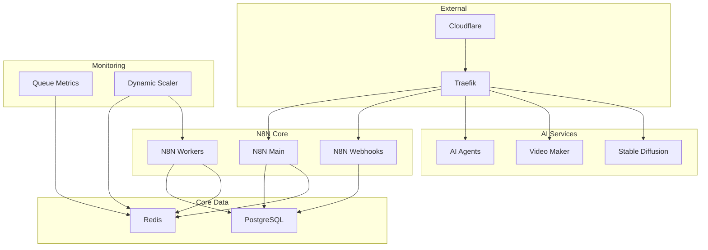

# Service Reference Guide

Complete reference for all services in the N8N AI Services Platform.

## 🏗️ Core Infrastructure Services

### N8N Main (`n8n-main`)

**Primary N8N instance handling web UI and main workflow execution**

- **Port:** 5678
- **Health Check:** HTTP GET `/healthz`
- **Dependencies:** PostgreSQL, Redis
- **Key Environment Variables:**

  ```bash
  N8N_HOST=n8n.domain.com
  N8N_ENCRYPTION_KEY=your-key
  EXECUTIONS_MODE=queue
  DB_TYPE=postgresdb
  ```

### N8N Workers (`n8n-worker`)

**Auto-scaled worker instances for queue-based execution**

- **Auto-scaled:** 1-5 instances (configurable)
- **Dependencies:** PostgreSQL, Redis, N8N Main
- **Scaling Triggers:** Queue depth > 5 jobs
- **Key Environment Variables:**

  ```bash
  N8N_CONCURRENCY_PRODUCTION_LIMIT=10
  QUEUE_BULL_REDIS_HOST=redis
  ```

### N8N Webhook (`n8n-webhook`)

**Dedicated webhook handler for high-throughput webhook processing**

- **Dependencies:** N8N Main, PostgreSQL, Redis
- **Purpose:** Isolates webhook traffic from main UI
- **Auto-starts:** With main N8N instance

## 📊 Monitoring & Scaling Services

### Queue Metrics Monitor (`n8n-queue-metrics`)

**Real-time Redis queue monitoring with structured logging**

- **Purpose:** Monitor BullMQ queue depth and statistics
- **Logging:** Structured JSON with timestamps
- **Health Check:** Redis connectivity
- **Configuration:**

  ```bash
  REDIS_HOST=redis
  REDIS_PORT=6379
  QUEUE_NAME_PREFIX=bull
  QUEUE_NAME=jobs
  POLL_INTERVAL_SECONDS=5
  ```

**Key Features:**

- ✅ Multi-pattern BullMQ support (v3+, v4+, legacy)
- ✅ Automatic Redis reconnection
- ✅ Exponential backoff on errors
- ✅ Comprehensive queue statistics

### Dynamic Scaler (`n8n-dynamic-scaler`)

**Intelligent auto-scaling based on queue metrics**

- **Purpose:** Scale N8N workers based on real-time demand
- **Method:** Docker Compose scaling commands
- **Cooldown:** 120 seconds between actions
- **Configuration:**

  ```bash
  MIN_REPLICAS=1
  MAX_REPLICAS=5
  SCALE_UP_QUEUE_THRESHOLD=5
  SCALE_DOWN_QUEUE_THRESHOLD=0
  POLLING_INTERVAL_SECONDS=30
  COOLDOWN_PERIOD_SECONDS=120
  ```

**Scaling Logic:**

1. **Scale Up:** Queue > threshold AND replicas < max
2. **Scale Down:** Queue ≤ threshold AND replicas > min
3. **Gradual:** One worker at a time
4. **Protected:** Respects cooldown periods

## 🗄️ Data Services

### PostgreSQL (`n8n-postgres`)

**Primary database for N8N workflow and execution data**

- **Version:** PostgreSQL 17
- **Port:** 5432 (internal)
- **Health Check:** `pg_isready`
- **Data Volume:** `./postgres-data/pgdata`
- **Configuration:**

  ```bash
  POSTGRES_DB=n8n_db
  POSTGRES_USER=postgres
  POSTGRES_PASSWORD=secure-password
  POSTGRES_HOST_AUTH_METHOD=scram-sha-256
  ```

### Redis (`n8n-redis`)

**Queue management and caching**

- **Version:** Redis 7 Alpine
- **Port:** 6379 (internal)
- **Health Check:** `redis-cli ping`
- **Data Volume:** `./backups/redis`
- **Purpose:** BullMQ job queue, session storage

### MinIO (`n8n-miniio`)

**S3-compatible object storage**

- **Ports:** 9000 (API), 9001 (Console)
- **Web Console:** `https://minio-console.domain.com`
- **Data Volume:** `./data/minio`
- **Configuration:**

  ```bash
  MINIO_ROOT_USER=minioadmin
  MINIO_ROOT_PASSWORD=secure-password
  ```

## 🌐 Network & Proxy Services

### Traefik (`n8n-traefik`)

**Reverse proxy and load balancer**

- **Ports:** 80 (HTTP), 8081 (Dashboard), 8082 (N8N UI), 8083 (Webhooks)
- **Dashboard:** `https://traefik.domain.com`
- **Features:** SSL termination, routing, rate limiting
- **Configuration:**

  ```bash
  TRAEFIK_HOST=traefik.domain.com
  IP_WHITELIST_RANGE=0.0.0.0/0
  ```

**Key Features:**

- ✅ Automatic service discovery
- ✅ Let's Encrypt SSL (via Cloudflare)
- ✅ Rate limiting (100 req/sec avg, 200 burst)
- ✅ Security headers
- ✅ IP whitelisting support

### Cloudflare Tunnel (`n8n-cloudflared`)

**Secure tunnel for external access**

- **Purpose:** Secure external access without port forwarding
- **Configuration:**

  ```bash
  CLOUDFLARE_TUNNEL_TOKEN=your-tunnel-token
  ```

- **Dependencies:** Traefik for internal routing

## 🤖 AI Services

### AI Agents CPU (`n8n-ai-agent-cpu`)

**General-purpose AI processing service**

- **Port:** 8000
- **API Docs:** `/docs` endpoint
- **Image:** `gyoridavid/ai-agents-no-code-tools:latest`
- **Features:** Text processing, analysis, GPT integration
- **Configuration:**

  ```bash
  LOG_LEVEL=debug
  PYTORCH_DISABLE_CUDA=1
  TORCH_DEVICE=cpu
  ```

### AI Agents ROCm (`n8n-ai-agent-rocm`)

**GPU-accelerated AI processing (Not supported in current version)**

- **Port:** 8008
- **Profile:** `disabled` (not functional with CogVideo and other services)
- **Status:** Removed due to compatibility issues
- **Note:** Use CPU version instead

### Short Video Maker CPU (`n8n-short-video-maker-cpu`)

**Video generation service (CPU-based)**

- **Port:** 3123
- **Health Check:** `/health`
- **Features:** Video creation, editing, Whisper speech recognition
- **Configuration:**

  ```bash
  PEXELS_API_KEY=your-api-key
  LOG_LEVEL=debug
  ```

### Short Video Maker ROCm (`n8n-short-video-maker-rocm`)

**GPU-accelerated video generation (Not supported in current version)**

- **Profile:** `disabled` (not functional with CogVideo and other services)
- **Status:** Removed due to compatibility issues
- **Note:** Use CPU version instead

### Kokoro TTS (`n8n-kokoro-tts`)

**Text-to-speech service**

- **Port:** 8880
- **Health Check:** `/health`
- **Image:** `ghcr.io/remsky/kokoro-fastapi-cpu:v0.2.2`
- **Features:** High-quality speech synthesis

### Intelligent Cropper (`n8n-intelligent-cropper`)

**AI-powered image and video cropping**

- **Port:** 8888
- **Build:** Custom Dockerfile in `./cropper`
- **Features:** MediaPipe-based intelligent cropping
- **Configuration:**

  ```bash
  PROCESSING_MODE=mediapipe
  ```

## 🎨 Advanced AI Services (Animation Profile)

### Stable Diffusion (`n8n-stable-diffusion`)

**Image generation with Stable Diffusion**

- **Port:** 7860
- **Profile:** `anim`
- **Web UI:** Full-featured Stable Diffusion WebUI
- **GPU:** ROCm-optimized for AMD cards
- **Models:** Downloaded on first run
- **Configuration:**

  ```bash
  HSA_OVERRIDE_GFX_VERSION=10.3.0
  WEBUI_VERSION=stable
  PYTORCH_HIP_ALLOC_CONF=expandable_segments:True
  ```

### Stable Video Diffusion (`n8n-stable-video-diffusion`)

**Video generation with Stable Video Diffusion (CPU-only in current version)**

- **Port:** 8188
- **Profile:** `anim`
- **Engine:** ComfyUI-based
- **Model:** SVD-XT (9.5GB download)
- **Processing:** CPU-only (GPU support coming in future versions)

### WAN2.1 Video (`n8n-wan21-video`)

**Advanced video generation with WAN2.1 (CPU-only in current version)**

- **Port:** 8189
- **Profile:** `anim`
- **Features:** State-of-the-art video generation
- **Processing:** CPU-only (GPU support coming in future versions)

### CogVideo (`n8n-cogvideo`)

**Experimental video generation (CPU-only in current version)**

- **Port:** 8190
- **Profile:** `anim`
- **Status:** CPU-only processing
- **Features:** Alternative video generation approach

## 🛠️ Utility Services

### Backup Service (`n8n-backup`)

**Automated backup system**

- **Schedule:** Daily at midnight UTC
- **Retention:** 7 days
- **Includes:** PostgreSQL dumps, N8N data, workflows, credentials
- **Storage:** `./daily-backups/`

**Backup Contents:**

- Database dump (SQL format)
- N8N workflows and credentials
- Binary data and configurations
- Compressed tar.gz archives

### Baserow (`n8n-baserow`)

**No-code database platform**

- **Port:** 80 (internal)
- **Version:** 1.32.5
- **Data Volume:** `./data/baserow`
- **Web Interface:** `https://baserow.domain.com`
- **Configuration:**

  ```bash
  BASEROW_PUBLIC_URL=https://baserow.domain.com
  ```

### NCA Toolkit (`n8n-nca-toolkit`)

**No-Code Architects Toolkit**

- **Port:** 8080
- **Image:** `stephengpope/no-code-architects-toolkit:latest`
- **Features:** Additional automation tools
- **Configuration:**

  ```bash
  API_KEY=your-api-key
  S3_ENDPOINT_URL=http://n8n-miniio:9000
  ```

## 📊 Service Dependencies



## 🔧 Service Configuration Patterns

### Environment Variable Hierarchy

1. **Docker Compose environment section**
2. **ENV file (.env)**
3. **Dockerfile ENV statements**
4. **Container defaults**

### Health Check Patterns

```yaml
healthcheck:
  test: ["CMD", "curl", "-f", "http://localhost:port/health"]
  interval: 30s
  timeout: 10s
  retries: 3
  start_period: 60s
```

### Dependency Patterns

```yaml
depends_on:
  postgres:
    condition: service_healthy
  redis:
    condition: service_healthy
```

### Volume Mount Patterns

```yaml
volumes:
  - ./data:/app/data                    # Local directory
  - cache-volume:/app/cache             # Named volume
  - /var/run/docker.sock:/var/run/docker.sock:ro  # Docker socket
```

## 🚨 Service Troubleshooting

### Health Check Commands

```bash
# Check all service health
docker compose ps --format "table {{.Name}}\t{{.Health}}"

# Test specific service health
docker compose exec service-name curl -f http://localhost:port/health

# View health check logs
docker compose logs service-name | grep health
```

### Service Restart Strategies

```bash
# Graceful restart
docker compose restart service-name

# Force recreate
docker compose up -d --force-recreate service-name

# Rebuild and restart
docker compose up -d --build service-name
```

### Resource Monitoring

```bash
# Service resource usage
docker stats

# Service-specific stats
docker stats container-name

# Disk usage by service
docker system df
```

## 📋 Quick Reference Commands

```bash
# Start specific profile
docker compose --profile core up -d

# Scale specific service
docker compose up -d --scale n8n-worker=3

# View service logs
docker compose logs -f service-name

# Execute commands in service
docker compose exec service-name command

# Check service configuration
docker compose config

# Update specific service
docker compose pull service-name && docker compose up -d service-name
```

---

**Need more details?** Check the main [README.md](README.md) or [GETTING_STARTED.md](GETTING_STARTED.md) guides.

**Generated with [Claude Code](https://claude.ai/code)**
